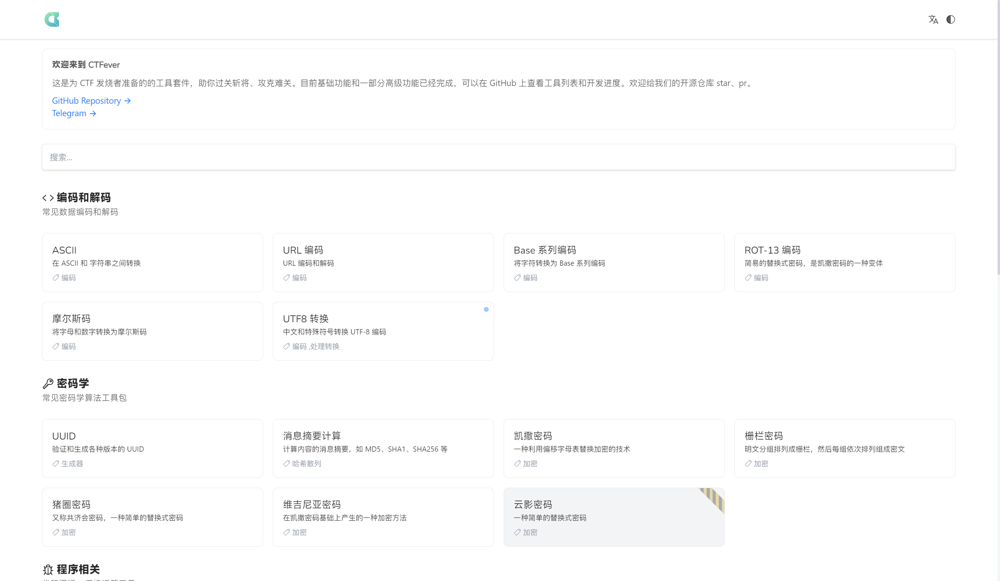
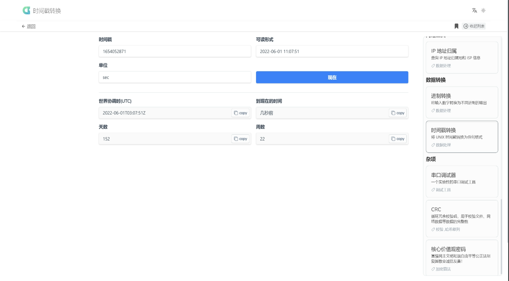

# CTFever - A Toolkit for CTF fevers


[](https://app.fossa.com/projects/git%2Bgithub.com%2FUniiemStudio%2FCTFever?ref=badge_shield)

---
> ### **近日训练学习任务繁重，可能更新较迟缓，欢迎大家加入我们的开发，欢迎 Pull Request**
---

## 简介

**CTFever** (CTF Fevers) 是为 CTF [(什么是CTF?)](https://baike.baidu.com/item/CTF) 发烧者准备的的常用工具套件，助你过关斩将、攻克难关。

## 使用

没有其他步骤，[马上开始使用](https://ctfever.uniiem.com/)

## 工具清单 & ToDo List

✅ **完成**
❎ **部分未完成**
❌ **已取消**
🚧 **进行中**
⏰ **未开始**

| 工具                                                             | 状态  | 工具                                                        | 状态  | 工具                                                           | 状态  |
|----------------------------------------------------------------|:---:|-----------------------------------------------------------|:---:|--------------------------------------------------------------|-----|
| [ASCII](https://ctfever.uniiem.com/tools/ascii)                |  ✅  | [URL 编码](https://ctfever.uniiem.com/tools/url-encoding)   |  ✅  | [Base64](https://ctfever.uniiem.com/tools/base-series)       | ✅   |
| [ROT13](https://ctfever.uniiem.com/tools/rot-series)           |  ✅  | [摩尔斯码](https://ctfever.uniiem.com/tools/morse-code)       |  ✅  | [UUID 生成校验](https://ctfever.uniiem.com/tools/uuid-generator) | ✅   |
| [摘要哈希计算](https://ctfever.uniiem.com/tools/message-digest)      |  ✅  | [凯撒密码](https://ctfever.uniiem.com/tools/caesar-cipher)    |  ✅  | [栅栏密码](https://ctfever.uniiem.com/tools/rail-fence-cipher)   | ❎   |
| [猪圈密码](https://ctfever.uniiem.com/tools/pigpen)                |  ✅  | [维吉尼亚密码](https://ctfever.uniiem.com/tools/vigenereCipher) |  ✅  | [Pyc 反编译](https://ctfever.uniiem.com/tools/pyc-decompiler)   | ✅   |
| [JSFuck](https://ctfever.uniiem.com/tools/jsfuck)              |  ✅  | [BrainFuck](https://ctfever.uniiem.com/tools/brain-fuck)  |  ✅  | [IP 归属地](https://ctfever.uniiem.com/tools/ip-geo)            | ✅   |
| [进制转换](https://ctfever.uniiem.com/tools/radix-conversion)      |  ✅  | [时间戳转换](https://ctfever.uniiem.com/tools/timestamp)       |  ✅  | [串口调试器](https://ctfever.uniiem.com/tools/serial)             | ✅   |
| [CRC 计算](https://ctfever.uniiem.com/tools/crc-checksum)        |  ✅  | Base64 图片转换                                               |  ⏰  | 与佛伦禅                                                         | ⏰   |
| [核心价值观密码](https://ctfever.uniiem.com/tools/core-values-cipher) |  ✅  | [端口分析](https://ctfever.uniiem.com/tools/port-scan)        |  ✅  | Binwalk 分析                                                   | ⏰   |

## 截图





## 特色

* 条理性，对 CTF 中常见的题型需要使用到的工具进行了分类
* 亲和力，UI 现代化，流畅简约，考虑用户的感受
* 积极性，开发团队活跃，频繁更新
* 互动性，接受用户的反馈和建议，第一时间做出合理更改
* 可定制，无服务器部分开源，可自由修改、定制 *(遵循 GPLv3 协议)*

## 目标和下一步计划

CTFever 的目标是涵盖大部分 CTF 题型所需要的工具。

下一步我们将着手开发如 **pyc 在线反编译** 、**在线执行 binwalk** 、**端口分析工具** 等依赖服务器运行的特色功能，并逐步释出更新，尽情期待！

## Stargazers 趋势

[](https://starchart.cc/UniiemStudio/CTFever)

## 贡献

### 开发环境和部署

```bash
# install dependencies
$ yarn install

# serve with hot reload at localhost:3000
$ yarn dev

# build for production and launch server
$ yarn build
$ yarn start

# generate static project
$ yarn generate
```

### [贡献指南](https://github.com/UniiemStudio/CTFever/blob/main/CONTRIBUTING.md)

[//]: # (## 耻辱榜)

[//]: # ()

[//]: # (这是一条记录和谴责那些违背了本项目使用的 **[GPLv3]&#40;https://github.com/UniiemStudio/CTFever/blob/main/LICENSE&#41;** 开源协议的人或站点的时间线。)

[//]: # ()

[//]: # (+ 2022.04.22 **ctftool.che\*\*\*\*\*.cn&#40;liyikun\*\*\*\*@gmail.com&#41;** 删除版权信息并重新分发)

### 捐赠

[](https://afdian.net/@hoshino_suzumi)

## License

[](https://app.fossa.com/projects/git%2Bgithub.com%2FUniiemStudio%2FCTFever?ref=badge_large)
